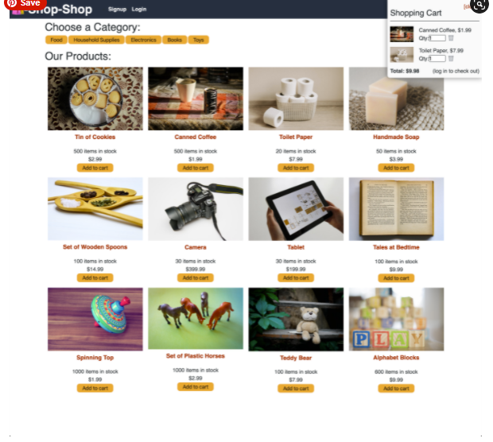

# shop-shop
Module 22: Global State *Final Module*

## Purpose
Enhance an existing e-commerce platform called Shop-Shop. 
Centralize all of the application's data in state globally to make it easier to share state across the entire application. 
Create a shopping cart for the application, add offline functionality, and process secure online payments with a service called Stripe.

## Built With
* Stripe
* Stripe.js
* Git Hub

## Contribution
Made with ❤️ by Samantha Malone
Shout out to my tutor
© 2021 Samantha Malone. All rights reserved.
